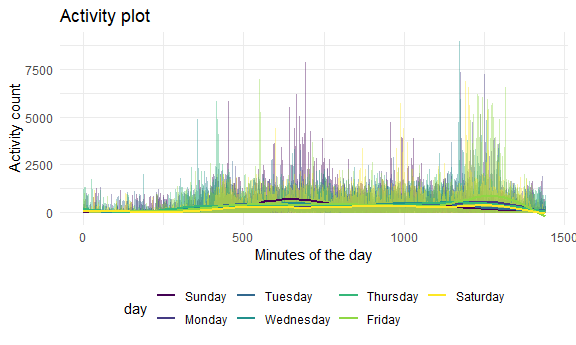

homework 3
================
Purnima Sharma
October 6, 2020

## Problem 1

``` r
data("instacart")
```

This dataset contains 1384617 rows and 15 columns.

Observations are the level of items in orders by a user. There are user
/ order variables: user ID, order ID, order day, and order hour. There
are also item variables: name, aisle, department, and some numeric
codes.

How many aisles, and which are most items from?

``` r
instacart %>% 
  count(aisle) %>% 
  arrange(desc(n))
```

    ## # A tibble: 134 x 2
    ##    aisle                              n
    ##    <chr>                          <int>
    ##  1 fresh vegetables              150609
    ##  2 fresh fruits                  150473
    ##  3 packaged vegetables fruits     78493
    ##  4 yogurt                         55240
    ##  5 packaged cheese                41699
    ##  6 water seltzer sparkling water  36617
    ##  7 milk                           32644
    ##  8 chips pretzels                 31269
    ##  9 soy lactosefree                26240
    ## 10 bread                          23635
    ## # ... with 124 more rows

Plot of \#of items in each aisle, for aisles with more than 10,000
items.

``` r
instacart %>% 
  count(aisle) %>%
  filter(n > 10000) %>%
  mutate(
    aisle = factor(aisle),
    aisle = fct_reorder(aisle, n)
  ) %>% 
  ggplot(aes(x = aisle, y = n)) +
  geom_point() +
  theme(axis.text.x = element_text(angle = 60, vjust = 0.5, hjust = 1))
```


Table of 3 most popular items in given aisles.

``` r
instacart %>% 
  filter(aisle %in% c("baking ingredients", "dog food care", "packaged vegetables fruits" )) %>% 
   group_by(aisle) %>% 
  count(product_name) %>% 
   mutate(rank = min_rank(desc(n))) %>% 
  filter(rank < 4) %>% 
  arrange(aisle, rank) %>% 
  knitr::kable()
```

| aisle                      | product\_name                                 |    n | rank |
| :------------------------- | :-------------------------------------------- | ---: | ---: |
| baking ingredients         | Light Brown Sugar                             |  499 |    1 |
| baking ingredients         | Pure Baking Soda                              |  387 |    2 |
| baking ingredients         | Cane Sugar                                    |  336 |    3 |
| dog food care              | Snack Sticks Chicken & Rice Recipe Dog Treats |   30 |    1 |
| dog food care              | Organix Chicken & Brown Rice Recipe           |   28 |    2 |
| dog food care              | Small Dog Biscuits                            |   26 |    3 |
| packaged vegetables fruits | Organic Baby Spinach                          | 9784 |    1 |
| packaged vegetables fruits | Organic Raspberries                           | 5546 |    2 |
| packaged vegetables fruits | Organic Blueberries                           | 4966 |    3 |

Table of mean hour of the day for order of given two products:Apples vs
ice cream

``` r
instacart %>% 
  filter(product_name %in% c("Pink Lady Apples", "Coffee Ice Cream")) %>% 
  group_by(product_name, order_dow) %>% 
  summarize(mean_hour = mean(order_hour_of_day)) %>% 
  pivot_wider(
    names_from = order_dow,
    values_from = mean_hour
  )
```

    ## `summarise()` regrouping output by 'product_name' (override with `.groups` argument)

    ## # A tibble: 2 x 8
    ## # Groups:   product_name [2]
    ##   product_name       `0`   `1`   `2`   `3`   `4`   `5`   `6`
    ##   <chr>            <dbl> <dbl> <dbl> <dbl> <dbl> <dbl> <dbl>
    ## 1 Coffee Ice Cream  13.8  14.3  15.4  15.3  15.2  12.3  13.8
    ## 2 Pink Lady Apples  13.4  11.4  11.7  14.2  11.6  12.8  11.9

## Problem 2

Read and tidy the accelerometer data.

``` r
accel_df = 
  read_csv("./data/accel_data.csv") %>% 
   pivot_longer(
    activity.1:activity.1440,
    names_to = "min_of_the_day",
    names_prefix = "activity.",
    values_to = "activity_count"
  )  %>% 
  mutate(
    min_of_the_day = as.numeric(min_of_the_day),
    day = factor(day)
  ) %>% 
  mutate(
  day_type = recode(day,"Saturday" = "weekend", "Sunday" = "weekend", "Monday" = "weekday", "Tuesday" = "weekday","Wednesday" = "weekday","Thursday" = "weekday","Friday" = "weekday")
  )
```

    ## Parsed with column specification:
    ## cols(
    ##   .default = col_double(),
    ##   day = col_character()
    ## )

    ## See spec(...) for full column specifications.

This dataset based on “accelerometer data” contains 50400 rows and 6
columns. The dataset consists information on 5 weeks of recorded
activity counts based on an accelerometer activity, by the minute of
each day. The activity count ranges from 1 to 8982.

Table of activity per day.

``` r
accel_df %>%
 ## day = fct_reorder(day)##
  group_by(week, day) %>% 
    summarize(total_daily_activity = sum(activity_count)) %>% 
  pivot_wider(
    names_from = "day",
    values_from = "total_daily_activity"
  )
```

    ## `summarise()` regrouping output by 'week' (override with `.groups` argument)

    ## # A tibble: 5 x 8
    ## # Groups:   week [5]
    ##    week  Friday  Monday Saturday Sunday Thursday Tuesday Wednesday
    ##   <dbl>   <dbl>   <dbl>    <dbl>  <dbl>    <dbl>   <dbl>     <dbl>
    ## 1     1 480543.  78828.   376254 631105  355924. 307094.   340115.
    ## 2     2 568839  295431    607175 422018  474048  423245    440962 
    ## 3     3 467420  685910    382928 467052  371230  381507    468869 
    ## 4     4 154049  409450      1440 260617  340291  319568    434460 
    ## 5     5 620860  389080      1440 138421  549658  367824    445366

There seems to be least activity on Saturdays in weeks 4 and 5. Middle
of the weeks on Tuesdays through Thursdays showed the most consistent
high activity counts.

Graph of 24-hr activity for each day.

``` r
accel_df %>% 
  group_by(day_id) %>% 
  ggplot(aes(x = min_of_the_day, y = activity_count, color = day)) + 
  geom_line(alpha = .5) + 
  labs(
    title = "Activity plot",
    x = "Minutes of the day",
    y = "Activity count"
     ) +
  theme(legend.position = "bottom")
```



The graphs seems fairly consistent in pattern for all given days in a
week. Starting at 0 min, indicating midnight, there seems to be minimal
activity count up to roughly 6- 7am. Activity seems to peak in the
morning hours, and the again late in the evening. There were a few days
with more daytime activity tha usual.

## Problem 3
